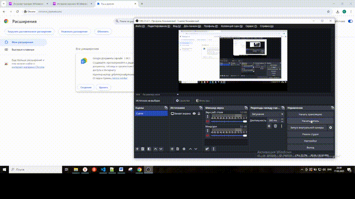

# Простой вариант
## 1. Описание
В папке extension_only_js содержится расширение для браузера Chrome,
которое позволяет по комбинации горячих клавиш (ctrl+shift+y) скачивать открытое видео
с отзыва на Wildberries.
## 2. Использование
Импортировать расширение в браузере Chrome и использовать.
## 3. Пример


# Посложнее вариант
## 1. Описание
В папке extension содержится расширение для браузера Chrome,
которое позволяет по комбинации горячих клавиш (ctrl+shift+y) скачивать открытое видео
с отзыва на Wildberries.
## 2. Технически
По комбинации горячих клавиш (ctrl+shift+y) передается "сырая" ссылка на видео на бэкэнд.
Бэкэнд на python обрабатывает ссылку и произовдит скачивание
## 3. Использование
  #### 1. Импортировать расширение в браузере Chrome.
  #### 2. Скачать ffmpeg и положить рядом с app.py.
  https://ffmpeg.org/download.html
  #### 3. Выполнить команды.
    ```
    python -m venv venv
    source venv/Scripts/activate
    pip install -r requirements.txt
    python app.py
    ```
  #### 4. Использовать в браузере по комбинации горячих клавиш (ctrl+shift+y), как в примере.
